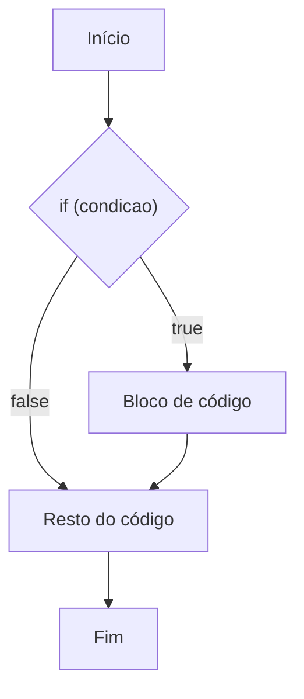
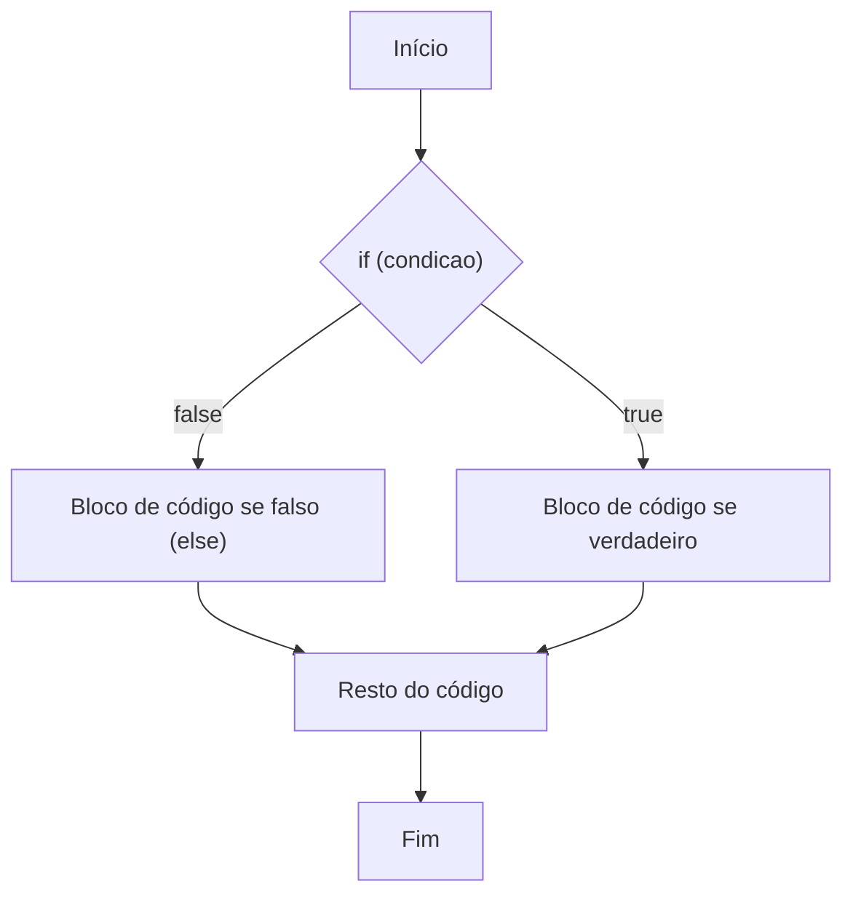
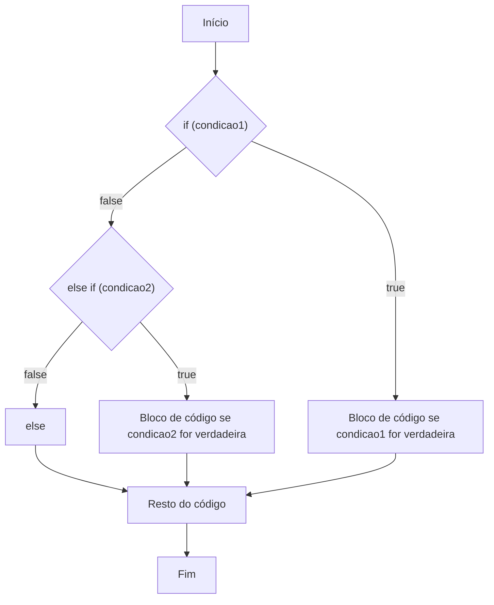
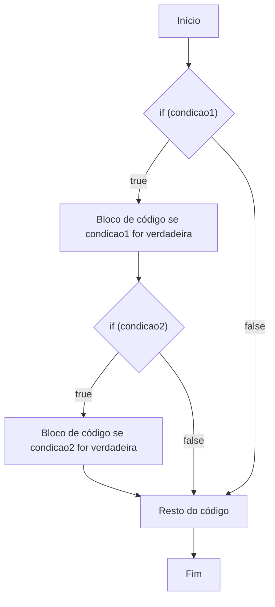

# Estruturas de controle

## Sumário

- [Estrutura de controle condicional](#estrutura-de-controle-condicional)
  - [Estrutura de controle condicional simples](#estrutura-de-controle-condicional-simples)
  - [Estrutura de controle condicional composta](#estrutura-de-controle-condicional-composta)
  - [Estrutura de controle condicional múltipla](#estrutura-de-controle-condicional-múltipla)
  - [Estrutura de controle condicional aninhada](#estrutura-de-controle-condicional-aninhada)
  - [Estrutura de controle condicional switch](#estrutura-de-controle-condicional-switch)
- [Estrutura de controle de repetição](#estrutura-de-controle-de-repetição)
  - [Estrutura de controle de repetição com variável de controle](#estrutura-de-controle-de-repetição-com-variável-de-controle-for)
  - [Estrutura de controle de repetição com teste no início](#estrutura-de-controle-de-repetição-com-teste-no-início-while)
  - [Estrutura de controle de repetição com teste no fim](#estrutura-de-controle-de-repetição-com-teste-no-fim-do-while)
- [Exercícios](#exercícios)
- [Referências](#referências)

## Estrutura de controle condicional

As estruturas de controle condicionais são usadas para controlar o fluxo de execução do programa com base em condições. 

### Estrutura de controle condicional simples

A estrutura condicional simples utiliza o comando `if` para executar um bloco de código apenas se uma condição for verdadeira.



Sintaxe:
```java
if (condicao) {
    // bloco de código a ser executado
}
```

Exemplo:
```java
int idade = 18;
if (idade >= 18) {
    System.out.println("Você é maior de idade");
}
```


### Estrutura de controle condicional composta

A estrutura condicional composta utiliza os comandos `if` e `else` para executar um bloco de código quando a condição for verdadeira e outro bloco quando for falsa.



Sintaxe:
```java
if (condicao) {
    // bloco de código se verdadeiro
} else {
    // bloco de código se falso
}
```

Exemplo:
```java
int idade = 16;
if (idade >= 18) {
    System.out.println("Você é maior de idade");
} else {
    System.out.println("Você é menor de idade");
}
```

### Estrutura de controle condicional múltipla

A estrutura condicional múltipla utiliza o comando `else if` para verificar múltiplas condições em sequência.



Sintaxe:
```java
if (condicao1) {
    // código se condicao1 for verdadeira
} else if (condicao2) {
    // código se condicao2 for verdadeira
} else {
    // código se nenhuma condição for verdadeira
}
```

Exemplo:
```java
int nota = 85;
if (nota >= 90) {
    System.out.println("Conceito A");
} else if (nota >= 80) {
    System.out.println("Conceito B");
} else if (nota >= 70) {
    System.out.println("Conceito C");
} else {
    System.out.println("Conceito D");
}
```

### Estrutura de controle condicional aninhada

A estrutura de controle condicional aninhada é uma estrutura condicional que utiliza outra estrutura condicional dentro de si.



Sintaxe:
```java
if (condicao1) {
    // bloco de código se condicao1 for verdadeira
    if (condicao2) {
        // bloco de código se condicao2 for verdadeira
    }
}
```

### Estrutura de controle condicional switch

A estrutura de controle condicional switch é uma estrutura condicional que utiliza uma variável para controlar o fluxo de execução do programa.

Sintaxe:
```java
switch (variavel) {
    case valor1:
        // bloco de código se variavel for igual a valor1
        break;
    case valor2:
        // bloco de código se variavel for igual a valor2
        break;
}
```

Exemplo:
```java
int numero = 2;
switch (numero) {
    case 1:
        System.out.println("Número 1");
        break;
    case 2:
        System.out.println("Número 2");
        break;
    default:
        System.out.println("Número não encontrado");
}
```

## Estrutura de controle de repetição

### Estrutura de controle de repetição com variável de controle (for)

O laço `for` é utilizado quando sabemos previamente o número de iterações que queremos executar.

Sintaxe:
```java
for (inicialização; condição de permanência; incremento) {
    // bloco de código a ser repetido
}
```

Exemplo:
```java
// Imprime os números de 1 a 5
for (int i = 1; i <= 5; i++) {
    System.out.println(i);
}
```

### Estrutura de controle de repetição com teste no início (while)

O laço `while` é utilizado quando queremos repetir um bloco de código enquanto uma condição for verdadeira, sendo a condição verificada antes da execução do bloco.

Sintaxe:
```java
while (condicao) {
    // bloco de código a ser repetido
}
```

Exemplo:
```java
int contador = 1;
while (contador <= 5) {
    System.out.println(contador);
    contador++;
}
```

### Estrutura de controle de repetição com teste no fim (do-while)

O laço `do-while` é similar ao `while`, mas garante que o bloco de código seja executado pelo menos uma vez, pois a condição é verificada após a execução do bloco.

Sintaxe:
```java
do {
    // bloco de código a ser repetido
} while (condicao);
```

Exemplo:
```java
int numero = 1;
do {
    System.out.println(numero);
    numero++;
} while (numero <= 5);
```

## Exercícios

### 1. Faça um programa que receba um número e imprima se ele é par ou ímpar.
Para verificar se um número é par ou ímpar, podemos usar o operador de módulo `%`. Se o número for par, o resto da divisão por 2 será 0. Se for ímpar, o resto será 1.

### 2. Faça um programa que receba um número e imprima se ele é positivo ou negativo.
Para verificar se um número é positivo ou negativo, podemos usar o operador de comparação `>`. Se o número for maior que 0, ele é positivo. Se for menor que 0, ele é negativo.

### 3. Faça um programa que receba um número e imprima se ele é primo ou não.
Para verificar se um número é primo, podemos usar um laço `for` para testar se ele é divisível por algum número além de 1 e ele mesmo. Se for divisível por algum outro número, ele não é primo.

### 4. Faça um programa que receba um número e imprima a tabuada dele.
Para imprimir a tabuada de um número, podemos usar um laço `for` para multiplicar o número por todos os números de 1 a 10.

### 5. Faça um programa que receba um número e imprima a sequência de Fibonacci até esse número.
A sequência de Fibonacci é uma sequência de números onde cada número é a soma dos dois números anteriores.

Exemplo:
```
Sequência de Fibonacci até o 10º valor é:
0 1 1 2 3 5 8 13 21 34
```

## Referências

- [Estrutura de controle condicional - IF-ELSE](https://www.javatpoint.com/java-if-else)
- [Estrutura de controle condicional - SWITCH](https://www.javatpoint.com/java-switch)
- [Estrutura de controle de repetição - FOR](https://www.javatpoint.com/java-for-loop)
- [Estrutura de controle de repetição - WHILE](https://www.javatpoint.com/java-while-loop)
- [Estrutura de controle de repetição - DO-WHILE](https://www.javatpoint.com/java-do-while-loop)
- [Estrutura de controle condicional switch](https://www.javatpoint.com/java-switch-statement)
