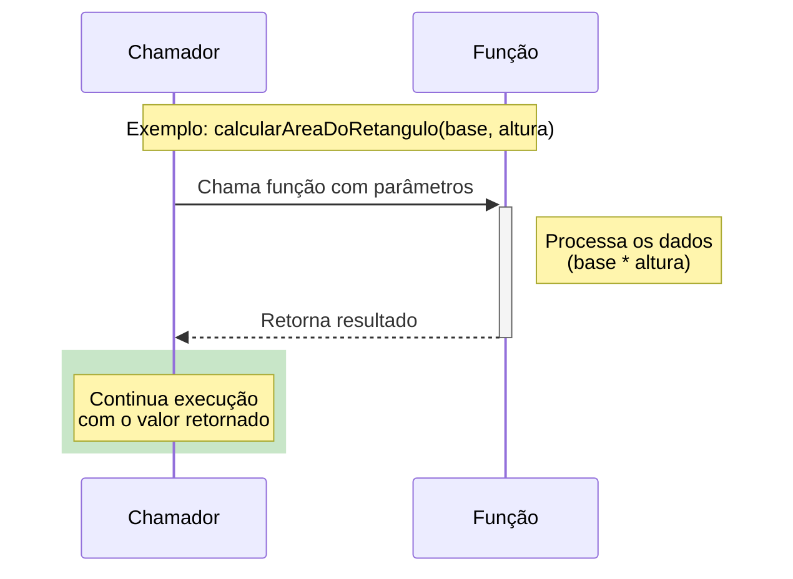
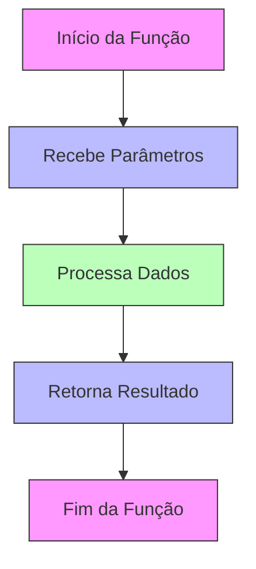

# Funções

## Sumário

- [Funções em Java](#funções-em-java)
  - [Sintaxe de uma função](#sintaxe-de-uma-função)
  - [Parâmetros](#parâmetros)
  - [Retorno](#retorno)
- [Subrotinas](#subrotinas)
- [Chamando uma função](#chamando-uma-função)
- [Exercícios](#exercícios)

## Funções em Java

Em Java, as funções são chamadas de métodos. Uma função em Java possui uma assinatura e um corpo. A assinatura de uma função é composta pelo nome da função e pelos tipos de seus parâmetros. O corpo de uma função é o conjunto de instruções que compõem a função.

A finalidade de uma função é executar uma tarefa específica e retornar um resultado.

Podemos representar a função como um diagrama de sequência:



De outra forma, podemos representar a função como um diagrama de fluxo sequencial:



### Sintaxe de uma função

A sintaxe básica de uma função em Java é a seguinte:

```java
public static tipoDoRetorno nomeDaFuncao(tipoDoParametro1 parametro1, tipoDoParametro2 parametro2) {
  // corpo da função
  return valorDeRetorno;
}
```

No qual `tipoDoRetorno` é o tipo de dado que a função retorna, `nomeDaFuncao` é o nome da função, `tipoDoParametro1` e `tipoDoParametro2` são os tipos de dados dos parâmetros da função e `valorDeRetorno` é o valor que a função retorna.

Por exemplo, uma função que calcula a área de um retângulo pode ser escrita da seguinte forma:

```java
public static double calcularAreaDoRetangulo(double base, double altura) {
  return base * altura;
}
```

### Parâmetros

Os parâmetros de uma função são os valores que a função recebe para executar sua tarefa. Eles são declarados na assinatura da função e são separados por vírgulas.

Por exemplo, a função `calcularAreaDoRetangulo` (definida anteriormente) recebe dois parâmetros: `base` e `altura`.

### Retorno

O retorno de uma função é o valor que a função retorna para o chamador. Ele é declarado na assinatura da função e é precedido pelo tipo de dado que a função retorna.

Por exemplo, a função `calcularAreaDoRetangulo` retorna um valor do tipo `double`.

## Subrotinas

Uma subrotina é uma função que não retorna um valor. Ela é definida usando a palavra-chave `void` como tipo de retorno.

Por exemplo, uma subrotina que imprime uma mensagem na tela pode ser escrita da seguinte forma:

```java
public static void imprimirMensagem(String mensagem) {
  System.out.println(mensagem);
}
```

## Chamando uma função

Para chamar uma função, basta escrever o nome da função seguido dos parâmetros entre parênteses.

A função `imprimirMensagem` pode ser chamada da seguinte forma:

```java
imprimirMensagem("Olá, mundo!");
```

## Exercícios

### 1. Cálculo de área de um retângulo

Escreva uma função que recebe a base e a altura de um retângulo e retorna a sua área.

Exemplo de uso:

```java
double area = calcularAreaDoRetangulo(10, 5);
System.out.println("A área do retângulo é: " + area);
```

### 2. Mensagem de boas-vindas

Escreva uma função que recebe um nome e imprime uma mensagem de boas-vindas.

Exemplo de uso:

```java
imprimirMensagem("João");
``` 

### 3. Cálculo de cubo

Escreva uma função que recebe um número e retorna o seu cubo.

Exemplo de uso:

```java
double cubo = calcularCubo(3);
System.out.println("O cubo de 3 é: " + cubo);
```

### 4. Verificar se um número é par

Escreva uma função `public static boolean verificarPar(int numero)` que verifica se um número é par e retorna `true` se for par e `false` caso contrário.

Exemplo de uso:

```java
boolean par = verificarPar(2);
System.out.println("O número 2 é par? " + par); // imprime: true
```

### 5. Verificar se um número é primo

Escreva uma função `public static boolean verificarPrimo(int numero)` que verifica se um número é primo e retorna `true` se for primo e `false` caso contrário.

Exemplo de uso:

```java
boolean primo = verificarPrimo(7);
System.out.println("O número 7 é primo? " + primo); // imprime: true
```

### 6. Criação de array

Escreva uma função `public static int[] criarArray(int tamanho)` que cria um array de números inteiros aleatórios com o tamanho especificado.

Exemplo de uso:

```java
int[] array = criarArray(5);
imprimirArray(array); // imprime um array com 5 números inteiros aleatórios
```

### 7. Impressão de arrays

Escreva uma função `public static void imprimirArray(int[] array)` que imprime um array de números inteiros.

Exemplo de uso:

```java
int[] array = {1, 2, 3, 4, 5};
imprimirArray(array); // imprime: [1, 2, 3, 4, 5]
```

### 8. Ordenação de arrays

Escreva uma função `public static int[] ordenarArray(int[] array)` que ordena um array de números inteiros em ordem crescente. Não utilize o método `Arrays.sort()` da classe `java.util.Arrays` e nem outra função de ordenação pronta.

Exemplo de uso:

```java
int[] array = {5, 3, 8, 2, 1};
int[] arrayOrdenado = ordenarArray(array);
imprimirArray(arrayOrdenado); // imprime: [1, 2, 3, 5, 8]
```

### 9. Inversão de arrays

Escreva uma função `public static int[] inverterArray(int[] array)` que inverte um array de números inteiros.

Exemplo de uso:

```java
int[] array = {1, 2, 3, 4, 5};
int[] arrayInvertido = inverterArray(array);
imprimirArray(arrayInvertido); // imprime: [5, 4, 3, 2, 1]
```

### 10. Encontrar maior e menor número em um array

Escreva uma função `public static int[] encontrarMaiorEMenor(int[] array)` que encontra o maior e o menor número em um array de números inteiros e retorna um array com os dois valores.

Exemplo de uso:

```java
int[] array = {1, 2, 3, 4, 5};
int[] resultado = encontrarMaiorEMenor(array);
System.out.println("Maior: " + resultado[0]);
System.out.println("Menor: " + resultado[1]);
```
  
### 11. Soma de elementos de um array

Escreva uma função `public static int somarElementos(int[] array)` que soma todos os elementos de um array de números inteiros e retorna o resultado.

Exemplo de uso:

```java
int[] array = {1, 2, 3, 4, 5};
int soma = somarElementos(array);
System.out.println("A soma dos elementos do array é: " + soma); // imprime: 15
```