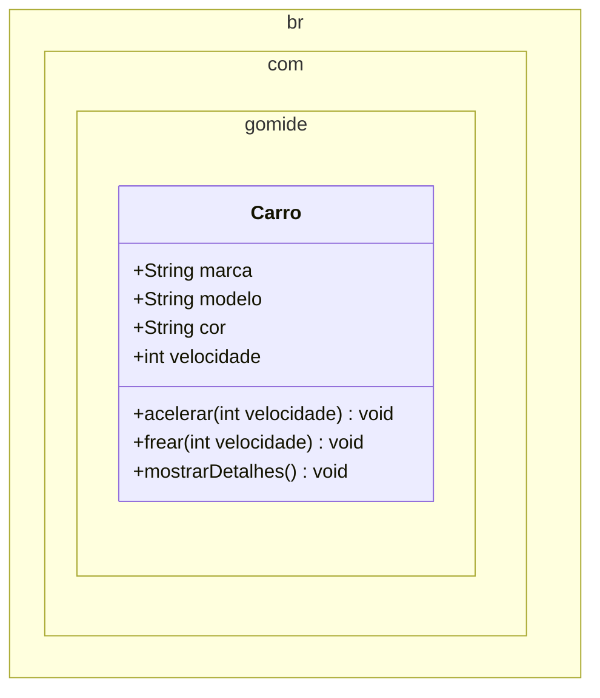

# Classes, objetos, atributos e métodos

## Sumário

- [Classes](#classes)
  - [Sintaxe na linguagem Java](#sintaxe-na-linguagem-java)
- [Atributos - Variáveis de instância](#atributos---variáveis-de-instância)
  - [Inicializando atributos](#inicializando-atributos)
  - [Declarando uma variável do tipo da classe](#declarando-uma-variável-do-tipo-da-classe)
  - [Acessando atributos de um objeto](#acessando-atributos-de-um-objeto)
- [Métodos - Funções de instância](#métodos---funções-de-instância)
  - [Definição de um método](#definição-de-um-método)
  - [Chamando um método](#chamando-um-método)
  - [Referenciando o objeto em si com o `this`](#referenciando-o-objeto-em-si-com-o-this)
- [Objetos](#objetos)
  - [Definição](#definição)
  - [Criando um objeto](#criando-um-objeto)
- [Pacotes](#pacotes)
  - [Definindo um pacote](#definindo-um-pacote)
  - [Importando um pacote](#importando-um-pacote)
  - [Nome do pacote](#nome-do-pacote)
  - [Estrutura de pastas](#estrutura-de-pastas)
- [Modificadores de acesso](#modificadores-de-acesso)
  - [Public](#public)
  - [Private](#private)
  - [Protected](#protected)
  - [Default](#default)
  - [Comparação entre modificadores de acesso](#comparação-entre-modificadores-de-acesso)
- [Diagrama de classe UML](#diagrama-de-classe-uml)
- [Exercícios](#exercícios)
- [Referências](#referências)

## Classes

Uma classe é uma estrutura que define um tipo de objeto. Ela encapsula dados e comportamentos relacionados a um determinado conceito, como um carro, uma pessoa ou uma conta bancária.

Por exemplo, uma classe [Carro](./src/br/com/gomide/Carro.java) pode ter características como `marca`, `modelo`, `cor` e `velocidade`, e ações como `acelerar`, `frear` e `mostrarDetalhes`.

### Sintaxe na linguagem Java

Na linguagem Java, uma classe é definida usando a palavra-chave `class`. O arquivo deve ter o mesmo nome da classe.

```java
public class Carro {
  // Implementação da classe Carro
}
```

## Atributos - Variáveis de instância

Os atributos, ou variáveis de instância, são as características que definem um objeto. Eles são declarados dentro da classe, fora dos métodos. Continuando com o exemplo da classe `Carro`, os atributos podem ser definidos como:

```java
public class Carro {
  // Atributos
  String marca;
  String modelo;
  String cor;
  int velocidade;
}
```

### Inicializando atributos

Um atributo pode ser inicializado com um valor padrão ou com um valor específico. O valor padrão depende do tipo de dado do atributo. Por exemplo, o atributo `String` é inicializado com `null`, o atributo `int` é inicializado com `0`, o atributo `double` é inicializado com `0.0`, e assim por diante.

Podemos também inicializar um atributo com um valor específico. Como por exemplo:

```java
public class Carro {
  String marca = "Ford";
}
```

### Declarando uma variável do tipo da classe

Uma vez que definimos a classe `Carro`, podemos declarar variáveis do tipo `Carro` em outros arquivos de um projeto Java. Primeiramente, devemos importar a classe `Carro` no arquivo onde vamos declarar a variável.

```java
import br.com.gomide.Carro;

public class Main {
  public static void main(String[] args) {
    Carro meuCarro = new Carro(); // Criando um objeto da classe Carro
  }
}
```

### Acessando atributos de um objeto

Para acessar os atributos de um objeto, usamos a notação de ponto (`.`) para referenciar o objeto e o atributo. Como exemplo, podemos acessar o atributo `marca` do objeto `meuCarro` da seguinte forma:

```java
meuCarro.marca = "Ford";

System.out.println("Marca do carro: " + meuCarro.marca);
```

## Métodos - Funções de instância

Os métodos são as funções que definem o comportamento de um objeto. Eles são declarados dentro da classe, dentro dos blocos delimitados por chaves `{}`.

### Definição de um método

Os métodos são definidos dentro da classe, fora dos blocos delimitados por chaves `{}`. Eles podem ter parâmetros, que são as variáveis que recebem valores quando o método é chamado.

```java
public class Carro {
  // Métodos
  public void acelerar(int novaVelocidade) {
    // Implementação do método acelerar
  }
}
```

### Chamando um método

Para chamar um método, usamos a notação de ponto (`.`) para referenciar o objeto e o método. Como exemplo, podemos chamar o método `acelerar` do objeto `meuCarro` da seguinte forma:

```java
meuCarro.acelerar(10);
```

### Referenciando o objeto em si com o `this`

O `this` é uma palavra reservada que referencia o próprio objeto. Ele é usado para acessar os atributos e métodos do próprio objeto. No método acelerar, podemos modificar a velocidade do carro para o valor passado como parâmetro a partir do atributo `velocidade` do próprio objeto.

```java
// classe Carro
public void acelerar(int novaVelocidade) {
  this.velocidade = novaVelocidade;
}

// classe Main
public class Main {
  public static void main(String[] args) {
    Carro meuCarro = new Carro();

    meuCarro.acelerar(10);
    System.out.println("Velocidade do carro: " + meuCarro.velocidade);
  }
}
```

## Objetos

### Definição

Um objeto é uma instância de uma classe. Ele é criado a partir de uma classe e possui os atributos e métodos definidos na classe. Podemos criar quantos objetos quisermos a partir de uma classe. Sendo assim, podemos ter vários objetos da classe `Carro`, cada um com seus próprios valores para os atributos particulares.

Uma classe pode ser vista como um plano de projeto para a criação de um objeto.

### Criando um objeto

Para criar um objeto, usamos a palavra-chave `new` seguida do nome da classe e parênteses. Como por exemplo, para criar um objeto da classe `Carro`, podemos realizar a seguinte instrução:

```java
Carro meuCarro = new Carro();
```

O próximo exemplo mostra como criar dois objetos da classe `Carro` com valores diferentes para os atributos:

```java
// ...

Carro meuCarro = new Carro();
Carro seuCarro = new Carro();

meuCarro.marca = "Ford";
meuCarro.modelo = "Fusion";
meuCarro.cor = "Preto";
meuCarro.velocidade = 0;

seuCarro.marca = "Chevrolet";
seuCarro.modelo = "Camaro";
seuCarro.cor = "Vermelho";
seuCarro.velocidade = 0;

System.out.println("Marca do meu carro: " + meuCarro.marca);
System.out.println("Marca do seu carro: " + seuCarro.marca);

// ...
```

## Pacotes

Um pacote é uma coleção de classes relacionadas. Ele é usado para organizar classes em grupos lógicos, facilitando a manutenção e a reutilização de código. Do ponto de vista de um projeto Java, podemos ter vários pacotes, cada um com suas classes relacionadas. 

Fisicamente, os pacotes são organizados em pastas, que são representadas por diretórios no sistema de arquivos do computador.

### Definindo um pacote

Para definir um pacote, usamos a palavra-chave `package` seguida do nome do pacote. Essa definição deve ser feita no início do arquivo, antes da definição da classe. Como por exemplo:

```java
package br.com.gomide;

public class Carro {
  // ...
}
```

### Importando um pacote

Para importar um pacote, usamos a palavra-chave `import` seguida do nome do pacote. Essa importação deve ser feita no início do arquivo, antes da definição da classe. Como por exemplo:

```java
import br.com.gomide.Carro;
```

### Nome do pacote

O nome do pacote deve ser um identificador válido em Java, que deve conter apenas letras minúsculas, números e o símbolo `_`. Além disso, o nome do pacote deve ser único dentro do projeto.

### Estrutura de pastas

A estrutura de pastas do projeto deve refletir a estrutura de pacotes. Como por exemplo, se temos o pacote `br.com.gomide`, devemos ter as seguintes pastas:

```
br/
└─ com/
   └─ gomide/
      └─ Carro.java
```

## Modificadores de acesso

Na linguagem Java, podemos definir o nível de acesso aos atributos e métodos de uma classe. Os modificadores de acesso são:
- `public`: o atributo ou método pode ser acessado por qualquer outro código na mesma classe ou em outras classes.
- `private`: o atributo ou método só pode ser acessado pelos métodos da própria classe.
- `protected`: o atributo ou método pode ser acessado pelos métodos da própria classe ou de subclasses.
- `default`: o atributo ou método só pode ser acessado pelos métodos da própria classe, ou seja, não tem modificador de acesso.

### Public

O modificador de acesso `public` permite que o atributo ou método seja acessado por qualquer outro código na mesma classe ou em outras classes. Como por exemplo:

```java
public class Carro {
  public String marca;
}
```

### Private

O modificador de acesso `private` permite que o atributo ou método seja acessado apenas pelos métodos da própria classe. Como por exemplo:

```java
public class Carro {
  private String marca;
}
```

Nesse caso, o atributo `marca` só pode ser acessado pelos métodos da classe `Carro`.

### Protected

O modificador de acesso `protected` permite que o atributo ou método seja acessado pelos métodos da própria classe ou de subclasses. Como por exemplo:

```java
public class Carro {
  protected String marca;
}
```

**Obs.:** Veremos mais sobre subclasses na aula de Herança.

### Default

O modificador de acesso `default` permite que o atributo ou método seja acessado pelos métodos da própria classe ou de outras classes que estão no mesmo pacote. Como por exemplo:

```java
public class Carro {
  String marca;
}
```

Nesse caso, o atributo `marca` pode ser acessado pelos métodos da classe `Carro` e de outras classes que estão no mesmo pacote.

### Comparação entre modificadores de acesso

A tabela a seguir mostra o nível de acesso de cada modificador de acesso em relação a classe, pacote, subclasses e outras classes:

| Modificador | Classe | Pacote | Subclasse | Outras classes |
|-------------|--------|--------|-----------|----------------|
| `public`    | Sim    | Sim    | Sim       | Sim            |
| `private`   | Sim    | Não    | Não       | Não            |
| `protected` | Sim    | Sim    | Sim       | Não            |
| `default`   | Sim    | Sim    | Não       | Não            |

## Diagrama de classe UML

A notação UML (Unified Modeling Language) é uma notação gráfica para representar conteúdos de um sistema. O diagrama de classe é uma das notações UML mais utilizadas para representar a estrutura de uma classe.

A classe [Carro](./src/br/com/gomide/Carro.java) pode ser representada pelo seguinte diagrama de classe:



O diagrama de classe é dividido em três compartimentos:

1. Nome da classe
2. Atributos
3. Métodos

Os modificadores de acesso são representados pelos símbolos `+`, `-` ou `#` e são representados antes do nome do atributo ou método. O símbolo `+` representa um atributo ou método público, o símbolo `-` representa um atributo ou método privado e o símbolo `#` representa um atributo ou método protegido.

## Exercícios

Em seu projeto, crie uma classe chamada `Main` para testar as classes desenvolvidas a partir dos exercícios propostos.

### Exercício 1 - Semáforo

Construa uma classe chamada `Luz` que simule um semáforo de tráfego. O atributo `cor` da classe deve mudar de `Verde` a `Amarelo` e `Vermelho` e de novo voltar para `Verde` mediante o método `mudar()`. Quando um objeto `Luz` é criado sua cor inicial será o `Vermelho`.


### Exercício 2 - Conta Bancária

Construa uma classe chamada `ContaBancaria` que simule uma conta bancária. O atributo `saldo` da classe deve ser inicializado com o valor `0.0`. O método `depositar(double valor)` deve aumentar o saldo em uma quantidade específica e o método `sacar(double valor)` deve diminuir o saldo em uma quantidade específica.

### Exercício 3 - Retângulo

Construa uma classe chamada `Retangulo` que simule um retângulo. O atributo `largura` e `altura` da classe devem ser inicializados com o valor `0`. O método `calcularArea()` deve calcular e retornar a área do retângulo e o método `calcularPerimetro()` deve calcular e retornar o perímetro do retângulo.

### Exercício 4 - Funcionário

Crie uma classe que represente um funcionário de um banco. A classe deve ter o nome do funcionário, o departamento onde trabalha (String), seu salário (double), a data de entrada no banco (String), seu RG (String) e um valor booleano que indique se o funcionário está na empresa no momento ou se já foi embora. 

Crie um método bonificar que aumenta o salário do funcionário de acordo com o parâmetro passado como argumento. Crie, também, um método demitir, que não recebe parâmetro algum, só modifica o valor booleano indicando que o funcionário não trabalha mais na empresa. Crie também um método mostrar, que não recebe e nem devolve valor algum, simplesmente imprime todos os atributos do funcionário.

### Exercício 5 - Sistema Acadêmico
Desenvolva uma classe `Estudante` no pacote `br.com.universidade.academico`. A classe deve ter os atributos: `matricula` (String), `nome` (String), `curso` (String), `notas` (array de double com tamanho 4) e `frequencia` (int representando porcentagem). Implemente métodos para `adicionarNota(int indice, double valor)`, `calcularMedia()` que retorna a média das notas, e `verificarAprovacao()` que retorna true se a média for maior ou igual a 7.0 e a frequência maior ou igual a 75%.

### Exercício 6 - Biblioteca
Crie uma classe chamada `Livro` no pacote `br.com.biblioteca.modelo`. A classe deve ter os atributos: `titulo` (String), `autor` (String), `numeroPaginas` (int), `anoPublicacao` (int) e `emprestado` (boolean). Crie métodos para emprestar o livro (`emprestar()`), que muda o estado de `emprestado` para true, e devolver o livro (`devolver()`), que muda o estado para false. O método `mostrarDetalhes()` deve exibir todas as informações do livro.

### Exercício 7 - Loja de Produtos Eletrônicos
Desenvolva uma classe `ProdutoEletronico` no pacote `br.com.loja.produtos`. A classe deve conter os atributos: `codigo` (int), `nome` (String), `preco` (double), `marca` (String), `modelo` (String) e `quantidadeEmEstoque` (int). Implemente métodos para `vender(int quantidade)`, que diminui o estoque, `reporEstoque(int quantidade)`, que aumenta o estoque, e `aplicarDesconto(double percentual)`, que reduz o preço. Adicione validações para não permitir estoque negativo ou percentual de desconto inválido.

### Exercício 8 - Sistema de Agendamento
Crie uma classe `Consulta` no pacote `br.com.clinica.agendamento`. Esta classe deverá ter os atributos: `paciente` (String), `medico` (String), `data` (String), `horario` (String), `realizada` (boolean) e `valorConsulta` (double). Adicione métodos para `remarcar(String novaData, String novoHorario)`, `cancelar()` que define o atributo `realizada` como false, e `calcularDesconto(double percentual)` que retorna o valor da consulta com desconto.

## Referências

- [Classes and Objects in Java](https://www.geeksforgeeks.org/classes-objects-java/)
- [Controlling Access to Members of a Class](https://docs.oracle.com/javase/tutorial/java/javaOO/accesscontrol.html)
- [Class Diagram](https://www.geeksforgeeks.org/unified-modeling-language-uml-class-diagrams/)