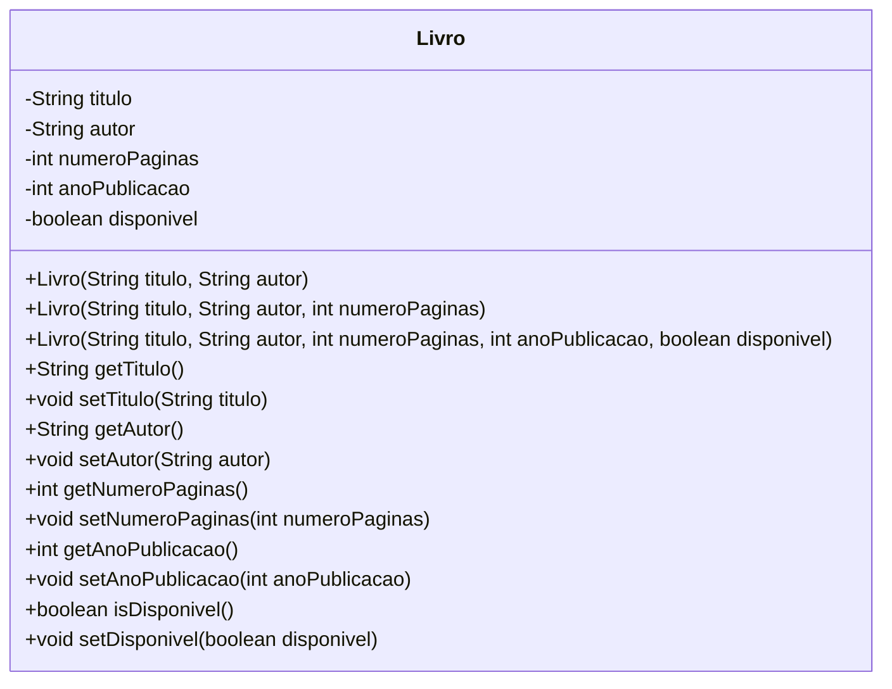
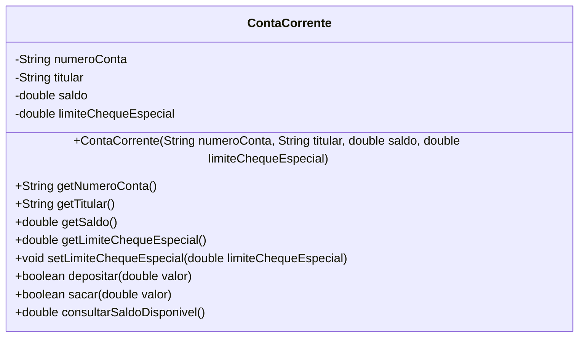
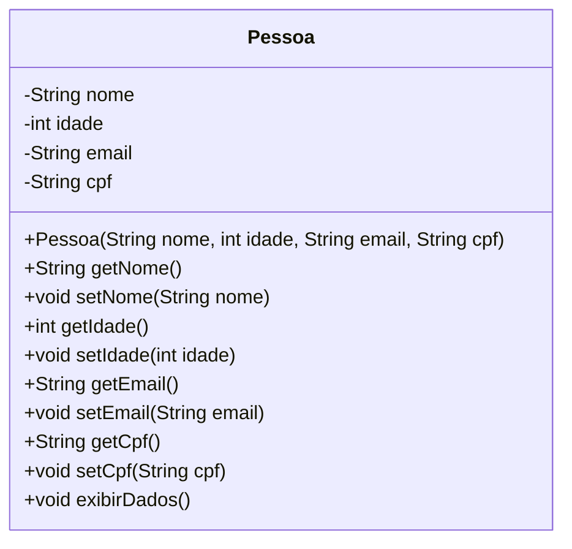
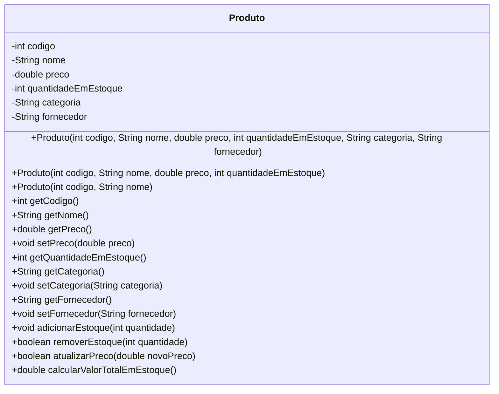
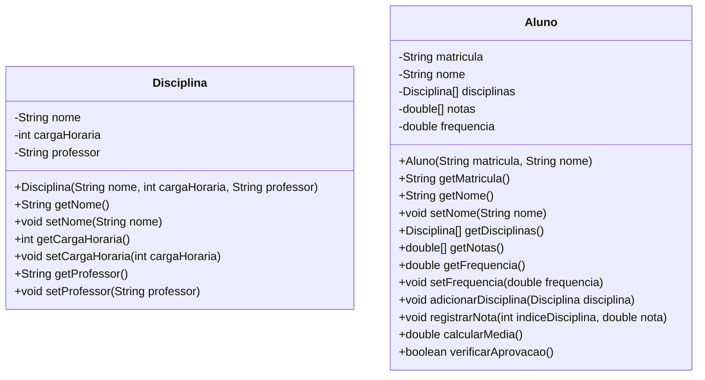

# Construtores e Encapsulamento

## Sumário
- [Construtores](#construtores)
  - [O que são construtores?](#o-que-são-construtores)
  - [Construtores padrão](#construtores-padrão)
  - [Construtores com parâmetros](#construtores-com-parâmetros)
  - [Sobrecarga de construtores](#sobrecarga-de-construtores)
  - [Construtores e a palavra-chave this](#construtores-e-a-palavra-chave-this)
- [Encapsulamento](#encapsulamento)
  - [O que é encapsulamento?](#o-que-é-encapsulamento)
  - [Métodos getters e setters](#métodos-getters-e-setters)
  - [Benefícios do encapsulamento](#benefícios-do-encapsulamento)
  - [Exemplo completo de encapsulamento](#exemplo-completo-de-encapsulamento)
- [Exercícios](#exercícios)

## Construtores

### O que são construtores?

Construtores são métodos especiais em Java que são chamados automaticamente quando um objeto é criado usando a palavra-chave `new`. Eles têm a função de inicializar os atributos do objeto e realizar qualquer configuração necessária para que o objeto esteja pronto para uso.

Características importantes dos construtores:
- Têm o mesmo nome da classe
- Não possuem tipo de retorno (nem mesmo `void`)
- São chamados automaticamente quando um objeto é instanciado

### Construtores padrão

Se você não definir explicitamente um construtor para uma classe, o Java fornecerá um construtor padrão (ou construtor implícito) que não recebe argumentos e não executa nenhuma inicialização específica.

```java
public class Pessoa {
    private String nome;
    private int idade;
    
    // O construtor padrão seria equivalente a:
    // public Pessoa() {
    //     // Não faz nada específico
    // }
}

// Usando o construtor padrão
Pessoa pessoa = new Pessoa();
```

### Construtores com parâmetros

Podemos criar construtores que recebem parâmetros para inicializar os atributos de um objeto durante sua criação.

```java
public class Pessoa {
    private String nome;
    private int idade;
    
    // Construtor com parâmetros
    public Pessoa(String nome, int idade) {
        this.nome = nome;
        this.idade = idade;
    }
}

// Usando o construtor com parâmetros
Pessoa pessoa = new Pessoa("João", 25);
```

### Sobrecarga de construtores

Uma classe pode ter múltiplos construtores, cada um com uma lista diferente de parâmetros. Isso é chamado de sobrecarga de construtores.

```java
public class Produto {
    private String nome;
    private double preco;
    private String categoria;
    
    // Construtor com todos os atributos
    public Produto(String nome, double preco, String categoria) {
        this.nome = nome;
        this.preco = preco;
        this.categoria = categoria;
    }
    
    // Construtor apenas com nome e preço
    public Produto(String nome, double preco) {
        this.nome = nome;
        this.preco = preco;
        this.categoria = "Sem categoria";
    }
    
    // Construtor apenas com nome
    public Produto(String nome) {
        this.nome = nome;
        this.preco = 0.0;
        this.categoria = "Sem categoria";
    }
}

// Usando diferentes construtores
Produto p1 = new Produto("Notebook", 3500.0, "Eletrônicos");
Produto p2 = new Produto("Caneta", 2.5);
Produto p3 = new Produto("Item sem preço");
```

### Construtores e a palavra-chave this

A palavra-chave `this` é usada para se referir ao objeto atual. Em construtores, ela pode ser usada para:

1. Diferenciar atributos da classe de parâmetros com o mesmo nome
2. Chamar outro construtor da mesma classe

```java
public class Aluno {
    private String nome;
    private int matricula;
    private String curso;
    
    // Construtor completo
    public Aluno(String nome, int matricula, String curso) {
        this.nome = nome;
        this.matricula = matricula;
        this.curso = curso;
    }
    
    // Construtor que chama outro construtor
    public Aluno(String nome, int matricula) {
        // Chama o construtor completo, passando "Não definido" como curso
        this(nome, matricula, "Não definido");
    }
}
```

## Encapsulamento

### O que é encapsulamento?

Encapsulamento é um dos quatro princípios fundamentais da Programação Orientada a Objetos (POO). Trata-se da técnica de esconder a implementação interna de uma classe e fornecer apenas o que é necessário para o mundo exterior através de interfaces bem definidas.

O encapsulamento permite:
- Proteger os dados internos de acesso direto
- Controlar como os dados são acessados e modificados
- Alterar a implementação interna sem afetar o código que usa a classe

### Métodos getters e setters

Para implementar encapsulamento, geralmente declaramos atributos como `private` e fornecemos métodos públicos para acessá-los (getters) e modificá-los (setters).

```java
public class ContaBancaria {
    private String titular;
    private double saldo;
    
    // Construtor
    public ContaBancaria(String titular, double saldoInicial) {
        this.titular = titular;
        
        // Validação de saldo inicial
        if (saldoInicial >= 0) {
            this.saldo = saldoInicial;
        } else {
            this.saldo = 0;
            System.out.println("Saldo inicial não pode ser negativo. Definido como zero.");
        }
    }
    
    // Getter para titular
    public String getTitular() {
        return titular;
    }
    
    // Getter para saldo
    public double getSaldo() {
        return saldo;
    }
    
    // Setter para titular
    public void setTitular(String titular) {
        this.titular = titular;
    }
    
    // Métodos específicos para manipular o saldo (em vez de setter direto)
    public void depositar(double valor) {
        if (valor > 0) {
            this.saldo += valor;
            System.out.println("Depósito de R$" + valor + " realizado com sucesso.");
        } else {
            System.out.println("Valor de depósito inválido.");
        }
    }
    
    public void sacar(double valor) {
        if (valor > 0 && valor <= saldo) {
            this.saldo -= valor;
            System.out.println("Saque de R$" + valor + " realizado com sucesso.");
        } else {
            System.out.println("Saldo insuficiente ou valor de saque inválido.");
        }
    }
}
```

### Benefícios do encapsulamento

1. **Controle de acesso**: Você pode controlar como e quem acessa os dados.
2. **Validação de dados**: Os setters podem verificar valores antes de atribuí-los.
3. **Flexibilidade de implementação**: Você pode alterar a implementação interna sem afetar o código cliente.
4. **Ocultar complexidade**: Detalhes internos complexos ficam escondidos.
5. **Manutenibilidade**: O código fica mais fácil de manter e entender.

### Exemplo completo de encapsulamento

Vamos ver um exemplo completo de uma classe que implementa encapsulamento adequadamente:

```java
public class Funcionario {
    // Atributos privados
    private String nome;
    private String cpf;
    private double salario;
    private String departamento;
    
    // Construtor
    public Funcionario(String nome, String cpf, double salario, String departamento) {
        this.nome = nome;
        this.setCpf(cpf); // Usando o setter para validar o CPF
        this.setSalario(salario); // Usando o setter para validar o salário
        this.departamento = departamento;
    }
    
    // Getters e Setters
    public String getNome() {
        return nome;
    }
    
    public void setNome(String nome) {
        this.nome = nome;
    }
    
    public String getCpf() {
        // Retorna apenas os primeiros dígitos e esconde o resto por segurança
        if (cpf != null && cpf.length() >= 9) {
            return cpf.substring(0, 3) + ".***.***-**";
        }
        return "CPF não definido";
    }
    
    public void setCpf(String cpf) {
        // Validação simples de CPF (apenas verificando o tamanho)
        if (cpf != null && (cpf.length() == 11 || cpf.length() == 14)) {
            this.cpf = cpf;
        } else {
            System.out.println("CPF inválido. Formato esperado: 11 dígitos ou 14 caracteres com pontuação.");
        }
    }
    
    public double getSalario() {
        return salario;
    }
    
    public void setSalario(double salario) {
        // Validação: salário não pode ser negativo nem zero
        if (salario > 0) {
            this.salario = salario;
        } else {
            System.out.println("Salário deve ser maior que zero.");
        }
    }
    
    public String getDepartamento() {
        return departamento;
    }
    
    public void setDepartamento(String departamento) {
        this.departamento = departamento;
    }
    
    // Métodos de negócio
    public void aumentarSalario(double percentual) {
        if (percentual > 0) {
            salario += salario * (percentual / 100);
            System.out.println("Salário aumentado para R$" + salario);
        } else {
            System.out.println("Percentual deve ser maior que zero.");
        }
    }
    
    public void exibirDados() {
        System.out.println("Nome: " + nome);
        System.out.println("CPF: " + getCpf());
        System.out.println("Salário: R$" + salario);
        System.out.println("Departamento: " + departamento);
    }
}
```

Uso da classe:

```java
public class TesteEncapsulamento {
    public static void main(String[] args) {
        // Criando um funcionário
        Funcionario func = new Funcionario("Maria Silva", "123.456.789-00", 3500.0, "TI");
        
        // Utilizando getters
        System.out.println("Nome: " + func.getNome());
        System.out.println("CPF: " + func.getCpf());
        System.out.println("Salário: " + func.getSalario());
        
        // Alterando dados com setters
        func.setDepartamento("Desenvolvimento");
        func.setSalario(4000.0);
        
        // Chamando método de negócio
        func.aumentarSalario(10);
        
        // Exibindo dados atualizados
        func.exibirDados();
        
        // Tentativa de validação
        func.setSalario(-1000); // Será rejeitado
        func.setCpf("123"); // Será rejeitado
    }
}
```

Este exemplo mostra como:
1. Proteger os dados com atributos `private`
2. Fornecer acesso controlado através de getters e setters
3. Implementar validação de dados nos setters
4. Esconder informações sensíveis (CPF parcialmente oculto)
5. Fornecer métodos específicos para operações de negócio

O encapsulamento é um dos pilares fundamentais da orientação a objetos e seu uso adequado torna o código mais robusto, seguro e fácil de manter.

## Exercícios

### Exercício 1: Criação de uma classe Livro com múltiplos construtores



Crie uma classe chamada `Livro` com os seguintes atributos privados:
- `titulo` (String)
- `autor` (String)
- `numeroPaginas` (int)
- `anoPublicacao` (int)
- `disponivel` (boolean)

Implemente três construtores diferentes:
1. Um construtor que receba apenas título e autor
2. Um construtor que receba título, autor e número de páginas
3. Um construtor que receba todos os atributos

Em todos os construtores, o atributo `disponivel` deve ser inicializado como `true` se não for informado. Além disso, implemente métodos getters e setters para todos os atributos.

Crie uma classe `TesteLivro` com um método `main` para testar a criação de livros usando os diferentes construtores.

### Exercício 2: Implementação de uma classe ContaCorrente com encapsulamento



Crie uma classe `ContaCorrente` que represente uma conta bancária com os seguintes atributos privados:
- `numeroConta` (String)
- `titular` (String)
- `saldo` (double)
- `limiteChequeEspecial` (double)

Implemente:
1. Um construtor que inicialize todos os atributos
2. Getters para todos os atributos
3. Setter apenas para `limiteChequeEspecial` (os outros atributos não devem ser alterados diretamente)
4. Métodos `depositar(double valor)`, `sacar(double valor)` e `consultarSaldoDisponivel()` que retorne a soma do saldo com o limite do cheque especial
5. O método `sacar` deve verificar se há saldo suficiente (considerando o cheque especial) e retornar um boolean indicando se a operação foi bem-sucedida

Aplique validações adequadas em todos os métodos para garantir que os valores sejam consistentes (ex: não permitir saques ou depósitos de valores negativos).

### Exercício 3: Classe Pessoa com validação de dados



Desenvolva uma classe `Pessoa` com os seguintes atributos privados:
- `nome` (String)
- `idade` (int)
- `email` (String)
- `cpf` (String)

Implemente:
1. Um construtor que inicialize todos os atributos
2. Getters e setters para todos os atributos
3. Validações nos setters:
   - `setIdade`: não aceitar idades negativas ou acima de 150 anos
   - `setEmail`: verificar se o email contém o caractere '@' (validação simples)
   - `setCpf`: verificar se o CPF tem 11 dígitos (sem formatação) ou 14 caracteres (com formatação)

Crie um método `exibirDados()` que mostre as informações da pessoa, mas exiba apenas os últimos 3 dígitos do CPF por questões de privacidade (ex: "***.***.***-12").

### Exercício 4: Sistema de Estoque com construtores em cadeia



Implemente um sistema simples de estoque com uma classe `Produto` que contenha:
- `codigo` (int)
- `nome` (String)
- `preco` (double)
- `quantidadeEmEstoque` (int)
- `categoria` (String)
- `fornecedor` (String)

Crie os seguintes construtores:
1. Um construtor completo que receba todos os atributos
2. Um construtor que receba código, nome, preço e quantidade, deixando categoria como "Geral" e fornecedor como "Não informado"
3. Um construtor que receba apenas código e nome, fixando preço como 0.0, quantidade como 0, e usando os valores padrão para categoria e fornecedor

Utilize o conceito de construtores em cadeia com a palavra-chave `this`.

Adicione métodos encapsulados para:
- Adicionar estoque (`adicionarEstoque(int quantidade)`)
- Remover estoque (`removerEstoque(int quantidade)`) com validação para não permitir quantidade negativa
- Atualizar preço (`atualizarPreco(double novoPreco)`) com validação para não aceitar preços negativos
- Calcular valor total em estoque (`calcularValorTotalEmEstoque()`) que multiplica preço pela quantidade

### Exercício 5: Sistema de Gerenciamento de Alunos



Desenvolva duas classes que trabalhem juntas:

**Classe Disciplina:**
- Atributos privados: `nome`, `cargaHoraria`, `professor`
- Construtor que inicialize todos os atributos
- Getters e setters apropriados

**Classe Aluno:**
- Atributos privados: `matricula`, `nome`, `disciplinas` (um array de objetos Disciplina), `notas` (um array de doubles), `frequencia` (um valor entre 0 e 100)
- Construtor que inicialize matricula, nome e crie arrays vazios para disciplinas e notas
- Métodos:
  - `adicionarDisciplina(Disciplina disciplina)`: adiciona uma disciplina ao array
  - `registrarNota(int indiceDisciplina, double nota)`: associa uma nota a uma disciplina específica
  - `setFrequencia(double frequencia)`: define a frequência com validação (0-100)
  - `calcularMedia()`: calcula a média das notas
  - `verificarAprovacao()`: retorna true se a média for >= a 7.0 E a frequência >= a 75%

Utilize encapsulamento adequado em todas as operações, garantindo que as regras de negócio sejam preservadas e que a classe funcione corretamente.