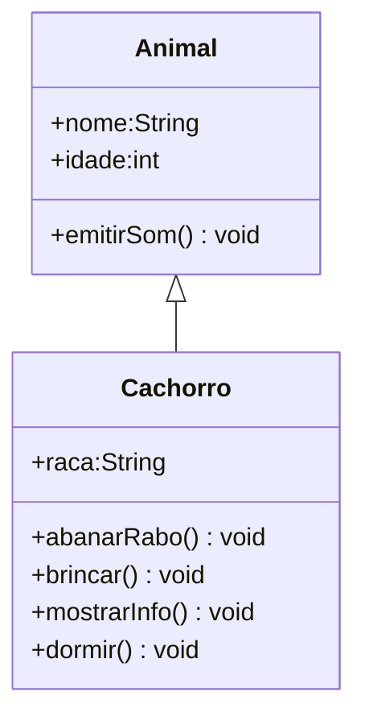

# Herança

## Sumário
- [Conceito de Herança](#conceito-de-herança)
- [Sintaxe da Herança em Java](#sintaxe-da-herança-em-java)
- [Tipos de Herança](#tipos-de-herança)
- [Modificadores de Acesso e Herança](#modificadores-de-acesso-e-herança)
- [A palavra-chave `super`](#a-palavra-chave-super)
- [Representação gráfica da herança na UML](#representação-gráfica-da-herança-na-uml)
- [Exercícios](#exercícios)

## Conceito de Herança

A herança é um dos pilares da Programação Orientada a Objetos (POO) que permite criar novas classes a partir de classes existentes. A nova classe (chamada de **subclasse** ou **classe filha**) herda características (atributos e métodos) da classe original (chamada de **superclasse** ou **classe pai**).

A herança ajuda a:
- Reutilizar código
- Estabelecer uma relação hierárquica entre classes
- Organizar classes relacionadas de forma lógica

## Sintaxe da Herança em Java

Em Java, a herança é implementada usando a palavra-chave `extends`:

```java
public class ClassePai {
    // atributos e métodos
}

public class ClasseFilha extends ClassePai {
    // herda atributos e métodos da ClassePai
    // pode ter atributos e métodos adicionais
}
```

### Exemplo Prático

```java
// Classe pai
public class Animal {
  private String nome;
  private int idade;

  public Animal(String nome, int idade) {
    this.nome = nome;
    this.idade = idade;
  }

  public void emitirSom() {
    System.out.println("Animal emitindo som");
  }

  public String getNome() {
    return nome;
  }

  public int getIdade() {
    return idade;
  }
}

// Classe filha
public class Cachorro extends Animal {
  private String raca;

  public Cachorro(String nome, int idade, String raca) {
    super(nome, idade); // Chama o construtor da classe pai
    this.raca = raca;
  }

  public void abanarRabo() {
    System.out.println("Cachorro abanando o rabo");
  }

  public String getRaca() {
    return raca;
  }

  public void brincar() {
    System.out.println(getNome() + " está brincando!");
  }

  public void mostrarInfo() {
    System.out.println("Nome: " + getNome());
    System.out.println("Idade: " + getIdade() + " anos");
    System.out.println("Raça: " + getRaca());
  }

  public void dormir() {
    System.out.println(getNome() + " de " + getIdade() + " anos está dormindo");
  }
}
```

Exemplo de uso:

```java
public class TesteHeranca {
  public static void main(String[] args) {
    Cachorro rex = new Cachorro("Rex", 3, "Labrador");

    System.out.println("Nome: " + rex.getNome()); // Método herdado
    System.out.println("Idade: " + rex.getIdade()); // Método herdado
    System.out.println("Raça: " + rex.getRaca()); // Método próprio

    rex.abanarRabo(); // Método próprio
  }
}
```

## Tipos de Herança

### Herança Simples

Java suporta apenas herança simples para classes, o que significa que uma classe só pode herdar diretamente de uma única classe pai.

```java
public class A { }
public class B extends A { } // B herda de A
```

### Herança Multinível

É possível criar uma cadeia de herança, onde uma classe herda de outra, que por sua vez herda de outra.

```java
public class Animal { }
public class Mamifero extends Animal { }
public class Cachorro extends Mamifero { }
```

### Herança Hierárquica

Ocorre quando várias classes herdam de uma única classe pai.

```java
public class Animal { }
public class Cachorro extends Animal { }
public class Gato extends Animal { }
public class Cavalo extends Animal { }
```

## Modificadores de Acesso e Herança

Os modificadores de acesso afetam como os membros (atributos e métodos) são herdados:

* **public**: membros são acessíveis em qualquer lugar
* **protected**: membros são acessíveis na mesma classe, nas subclasses e no mesmo pacote
* **default** (sem modificador): membros são acessíveis apenas no mesmo pacote
* **private**: membros não são herdados, somente acessíveis na própria classe

```java
public class Pessoa {
    public String nomePublico;       // Acessível em qualquer lugar
    protected String nomeProtegido;  // Acessível na classe, subclasses e pacote
    String nomeDefault;              // Acessível apenas no pacote
    private String nomePrivado;      // Acessível apenas na classe Pessoa
    
    // Métodos getters e setters...
}

public class Aluno extends Pessoa {
    void exemplo() {
        System.out.println(nomePublico);    // OK
        System.out.println(nomeProtegido);  // OK
        System.out.println(nomeDefault);    // OK se no mesmo pacote
        // System.out.println(nomePrivado); // ERRO - não acessível
    }
}
```

## A palavra-chave `super`

A palavra-chave `super` é usada para:

1. **Chamar o construtor da classe pai**:
```java
public Aluno(String nome, int idade, String curso) {
    super(nome, idade); // Chama o construtor da classe Pessoa
    this.curso = curso;
}
```

2. **Acessar membros da classe pai**:
```java
public void apresentar() {
    super.apresentar(); // Chama o método apresentar() da classe pai
    System.out.println("Sou estudante de " + curso);
}
```

## Representação gráfica da herança na UML



## Exercícios

### Exercício 1
Crie uma classe `Veiculo` com atributos como `marca`, `modelo` e `ano`. Em seguida, crie as subclasses `Carro` e `Moto` que herdam de `Veiculo`. Na classe `Carro`, adicione o atributo `numPortas` e na classe `Moto`, o atributo `cilindrada`. Implemente construtores, getters e setters apropriados.

### Exercício 2
Crie uma classe `Funcionario` com atributos `nome`, `cpf` e `salario`. Crie duas subclasses: `Gerente` e `Vendedor` com o método `calcularBonificacao(double totalVendas)`. Para o `Gerente`, a bonificação é 15% do salário, enquanto para o `Vendedor` é 10% do salário mais 0.5% do total de vendas realizadas.

### Exercício 3
Implemente um sistema de figuras geométricas usando herança. Crie uma classe `FiguraGeometrica` com atributos como `nome` e `cor`. Em seguida, crie as subclasses `Quadrado` (com atributo `lado`), `Circulo` (com atributo `raio`) e `Triangulo` (com atributos `base` e `altura`). Cada subclasse deve ter seus próprios métodos para calcular área e perímetro de acordo com sua forma específica.

### Exercício 4
Desenvolva um sistema de conta bancária. Crie uma classe `ContaBancaria` com atributos `numeroConta`, `titular` e `saldo`. Adicione os métodos `depositar(double valor)`, `sacar(double valor)` e `verSaldo()`. Em seguida, crie duas subclasses:
- `ContaPoupanca`: com atributo `taxaJuros` e método `calcularRendimento(int meses)` que retorna o rendimento baseado na taxa de juros e no saldo atual. A fórmula para calcular o rendimento é: `rendimento = saldo * taxaJuros * meses`.
- `ContaCorrente`: com atributos `limiteChequeEspecial` e `taxaManutencao`, e método `cobrarTaxaManutencao()` que debita a taxa do saldo

### Exercício 5
Crie uma hierarquia de classes para um sistema de produtos:

1. Crie uma classe base `Produto` com os atributos básicos:
- `codigo`
- `nome` 
- `preco`

2. Crie as seguintes subclasses que herdam de `Produto`:

- `ProdutoAlimenticio`:
  - Atributos adicionais: `dataValidade`
  - Métodos:
    - `verificarVencimento()`: verifica se o produto está vencido
    
- `ProdutoEletronico`:
  - Atributos adicionais: `voltagem`, `garantiaMeses`
  - Métodos:
    - `calcularGarantiaEstendida()`: retorna valor da garantia estendida
    
- `Livro`:
  - Atributos adicionais: `autor`, `editora`, `numPaginas`
  - Métodos:
    - `calcularFrete()`: retorna valor do frete baseado no número de páginas

Cada subclasse deve ter:
- Construtor que receba os atributos necessários
- Getters e setters apropriados
- Método `imprimirInformacoes()` que mostre os dados específicos de cada tipo de produto

Obs.: utilize a classe `java.util.Date` para representar a data de validade do produto alimentício. O comando `new Date()` cria um objeto com a data e hora atual. O comando `new GregorianCalendar(ano, mes, dia).getTime()` cria um objeto com a data especificada, o valor do mês vai de 0 a 11, sendo 0 janeiro e 11 dezembro.
