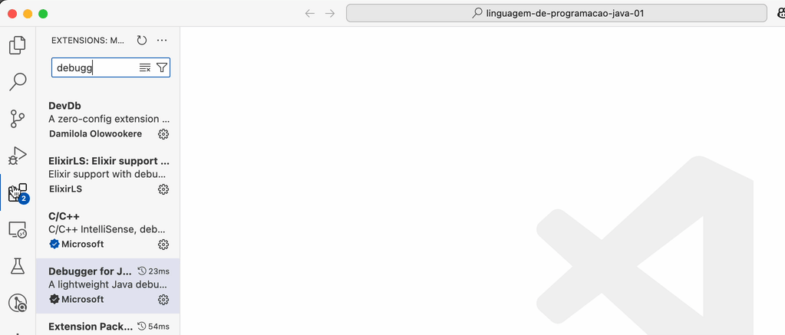

# Linguagem de Programação

## Revisão de programação estruturada

- [Variáveis, comandos de atribuição e expressões](00-variaveis/)
- [Estruturas de controle](01-estruturas-de-controle/)
- [Arrays](02-arrays/)
- [Funções](03-funcoes/)

## Programação Orientada a Objetos

- [Classes, objetos, atributos e métodos](04-classes-objetos-atributos-e-metodos/)
- [Construtores e encapsulamento](05-construtores-encapsulamento/)
- Atributos e métodos de classe
- Sobrecarga de métodos
- Herança
- Classes Object e String
- Polimorfismo

## Solução de problemas

### VSCode Java Debugger não carregando

  

